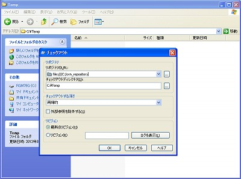
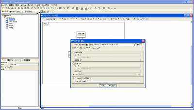
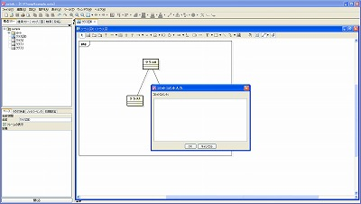

Subversion 簡易操作プラグイン
===============================

**バージョン**
----------------
1.0.16

**利用可能なAstah**
----------------
Astah Professional 6.7以上

**概要**
----------------
本プラグインはastah*上から以下のSubuversionの操作を行うプラグインです。  

1. 更新  
2. コミット  
3. ベースリビジョンとの差分比較  
4. 最新リビジョンとの差分比較

**注意事項**
----------------
リポジトリURL、ログインユーザ、ログインパスワードの保存は1アカウントのみ可能です。

**インストール方法**
----------------
0. [jarファイルをダウンロードします](http://astah.change-vision.com/plugins/svn_prototype/1.0.16.html)
1. Astahのインストールフォルダ配下のpluginsフォルダに本プラグインのjarファイルを置きます。
2. Astahを起動します。
3. メニューバーの「ツール」の一番下に「簡易SVN操作」と表示されていることを確認します。

**アンインストール方法**
----------------
Astahのインストールフォルダ配下のpluginsフォルダから本プラグインのjarファイルを削除してください。

**使用例**
----------------
1. 任意のディレクトリにリポジトリからチェックアウトします。  

2. Astahを起動し、図を作成、保存します。
3. 設定画面を開き、Subversionの設定を行います。  

4. リポジトリへのコミットを行います。  

**開発方法**
----------------
* Astah Plugin SDKのチュートリアルを参照します。
  * http://astah.change-vision.com/ja/plugin-tutorial/

**ライセンス**
---------------
Copyright 2012 Change Vision, Inc.

Licensed under the Apache License, Version 2.0 (the "License");
you may not use this work except in compliance with the License.
You may obtain a copy of the License in the LICENSE file, or at:

   <http://www.apache.org/licenses/LICENSE-2.0>

Unless required by applicable law or agreed to in writing, software
distributed under the License is distributed on an "AS IS" BASIS,
WITHOUT WARRANTIES OR CONDITIONS OF ANY KIND, either express or implied.
See the License for the specific language governing permissions and
limitations under the License.
